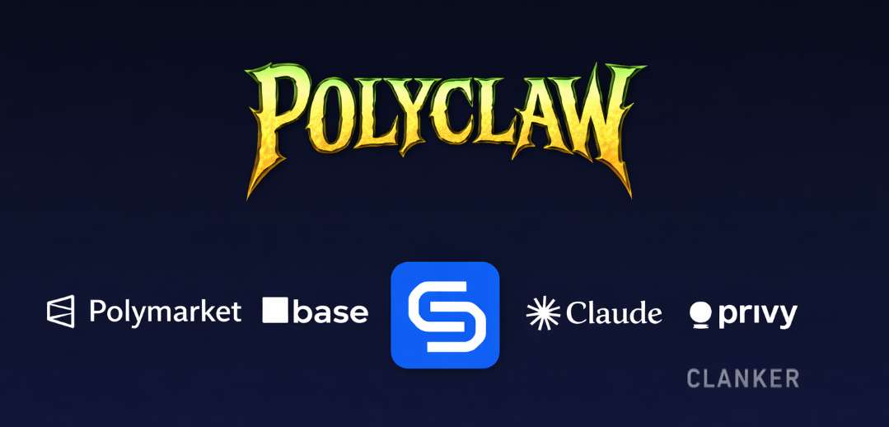
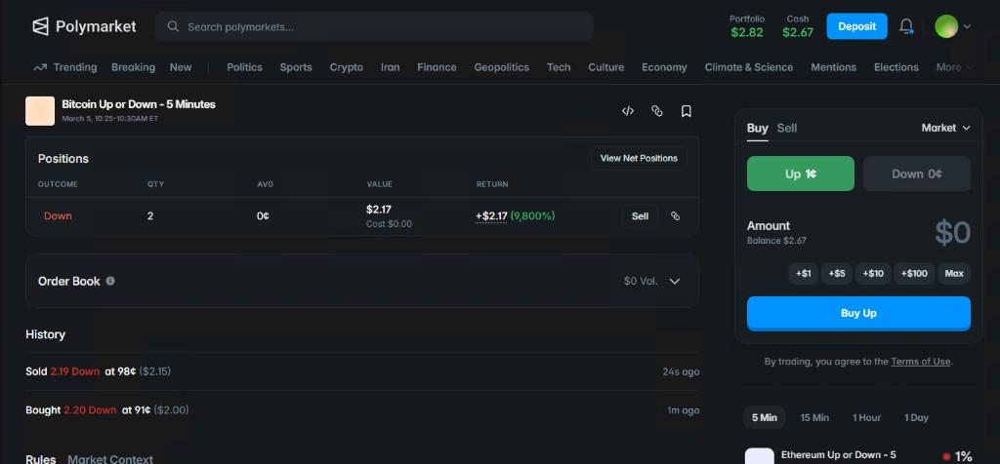
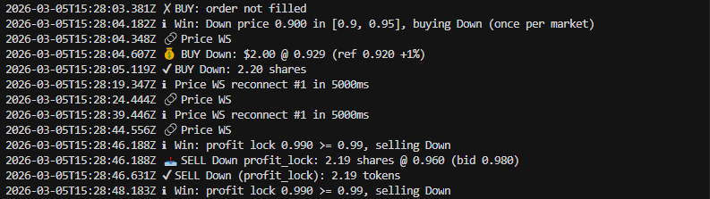

# Polymarket Arbitrage Trading Bot

Trading bot for Polymarket's "Up or Down" markets. It runs on 15-minute windows (Bitcoin, Ethereum, Solana, XRP) and uses a price prediction algorithm to place limit orders when it thinks it's got an edge. No Redis, no MongoDB — everything's stored in JSON files and plain text logs.

<p align="center">
  
</p>
## How it works

The core idea: the bot predicts whether the UP token price will move up or down, and only trades when it's confident enough (usually 50%+). When that happens, it slaps down a limit buy order at the best ask price (plus a small buffer so it actually fills).

Earnings come from getting predictions right — buying the winning side before the crowd — and holding through to resolution. You can lock in profits anytime by selling on Polymarket, or let the bot auto-redeem winning positions after markets resolve (there's a separate `auto-redeem.ts` script for that).

The predictor looks at price history, momentum, volatility, and trends. It adapts over time and tracks accuracy at each 15-minute boundary. If it's wrong a lot, it'll back off.

Example of a typical run:
- Predicts UP with 65% confidence
- Places limit buy: 5 shares @ 0.53
- Market resolves UP → correct

## What you get

- **Multi-market** — Run `btc`, `eth`, `sol`, `xrp` (or any combo) at once. Each market has its own predictor.
- **15-minute cycles** — Switches automatically at 0m, 15m, 30m, 45m. No babysitting.
- **Live prices** — WebSocket feeds, debounced so it's not spamming on every tick.
- **Accuracy tracking** — Summaries after each quarter-hour: how many predictions, correct vs wrong, costs, accuracy %.
- **Risk controls** — Max buy counts per side, minimum balance checks, market pausing when you hit limits.
- **Lightweight** — State in `src/data/copytrade-state.json`, logs to files. That's it.
- **Auto redeem** — Separate script to cash out winning positions after resolution.
- **Auto approve** — Sets up USDC allowance to Polymarket on startup.
- **Credentials** — Give it your `WALLET_PRIVATE_KEY` and it derives the CLOB API key. No manual key setup.

## Screenshots

Polymarket UI — market view, positions, selling:



Bot console — buys, WebSocket updates:



Auto redeem flow:


## How to Install

```bash
git clone https://github.com/sysnexus1/polymarket-arbitrage-bot.git
cd polymarket-arbitrage-bot
npm install
npm run dev
```

## Environment variables

Stick these in a `.env` file. Here's what matters:

**Market selection**
- `COPYTRADE_MARKETS` — Comma list: `btc`, `eth`, `sol`, `xrp` or mix like `btc,eth,sol`. Default: `btc`.

**Trading**
- `COPYTRADE_SHARES` — Shares per order (e.g. `5`)
- `COPYTRADE_PRICE_BUFFER` — Cents to add above best ask so orders fill (e.g. `0.01`). Default: `0`
- `COPYTRADE_TICK_SIZE` — Usually `0.01`
- `COPYTRADE_MAX_BUY_COUNTS_PER_SIDE` — Cap buys per side per market. `0` = no limit
- `COPYTRADE_FIRE_AND_FORGET` — Skip waiting for order confirm (faster). Default: `true`

**Credentials (required)**
- `WALLET_PRIVATE_KEY` — Your wallet's private key. The bot uses it to derive the Polymarket API key — you don't need to create one in their UI. Get it from MetaMask (Account details → Export). Don't share it.
- `SIG_TYPE` — `eoa` (default), `proxy`, or `gnosis` for Safe
- `PROXY_WALLET_ADDRESS` — If using proxy/Safe, the contract address

You don't set `POLY_API_KEY`, `POLY_PASSPHRASE`, etc. — the bot handles that.

**Bot behavior**
- `BOT_MIN_USDC_BALANCE` — Won't start below this (default: `1`)
- `BOT_MIN_RUN_BALANCE_USDC` — Stops if balance drops below (default: `50`)
- `COPYTRADE_WAIT_FOR_NEXT_MARKET_START` — Wait for next 15m boundary before trading. Default: `false`

**Optional**
- `CLOB_API_URL` — Leave default: `https://clob.polymarket.com`
- `CHAIN_ID` — 137 for Polygon
- `DEBUG` — Verbose logs
- `LOG_FILE_PATH`, `LOG_DIR`, `LOG_FILE_PREFIX` — Where logs go

Full list is in `.env.example`.

## Switching markets

Supported: `btc`, `eth`, `sol`, `xrp`. Just change `COPYTRADE_MARKETS` in `.env` and restart. The bot builds the 15-minute market slugs itself — you don't need token IDs or market URLs.

## Setup & run

After [install](#install), from the project root:

```bash
npm start
```

First run:
1. Copy `.env.example` to `.env`
2. Add your `WALLET_PRIVATE_KEY`
3. Set `COPYTRADE_MARKETS` (e.g. `btc` or `btc,eth,sol`)
4. Tweak `COPYTRADE_SHARES` and other params
5. Run it — it'll create credentials, approve USDC, and start trading

Auto-redeem:
```bash
npm run redeem:holdings
# or
ts-node src/auto-redeem.ts
ts-node src/auto-redeem.ts --api    # fetch from API
ts-node src/auto-redeem.ts --dry-run
```

BTC 5m market maker:
```bash
npm run btc5m:market-maker
```

The market-maker strategy is a dynamic version of the fixed-price `btc5m:range-arb` idea. It continuously quotes both UP and DOWN bids around a fair price, only keeps the paired bid cost below `1 - MM_MIN_LOCKED_EDGE`, and skews quotes away from whichever side has too much inventory.

Useful `.env` knobs:
- `MM_DRY_RUN` — Default `true`; set to `false` only when you are ready to post real orders.
- `MM_QUOTE_SHARES` — Shares per quote. Default `5`.
- `MM_MAX_USDC_PER_LEG` — Max USDC to spend buying UP or DOWN in each 5m round. Default `0` means unlimited.
- `MM_QUOTE_SPREAD` — Total width around fair value. Default `0.06`, so bids are roughly 3 cents below fair.
- `MM_MIN_LOCKED_EDGE` — Minimum theoretical edge when both BUY legs fill. Default `0.02`.
- `MM_INVENTORY_SKEW_PER_SHARE` — Price skew per excess share. Default `0.002`.
- `MM_MAX_INVENTORY_SHARES` — Stops adding paired bids once inventory reaches this cap. Default `30`.
- `MM_ENABLE_SELL_EXCESS` — Places SELL quotes for excess one-sided inventory. Default `true`.
- `MM_INTERVAL_MINUTES`, `MM_MARKET`, `MM_TICK_SIZE`, `MM_NEG_RISK` — Same idea as the range-arb settings.

BTC 5m edge backtest:
```bash
npm run backtest:btc5m -- --csv data/btc5m-history.csv
```

Collect BTC 5m history:
```bash
npm run collect:btc5m-history -- --duration-minutes 120 --out-dir data
```

This writes live samples to `data/btc5m-history.csv` by default. It is Polymarket-only unless `COLLECT_BTC_PRICE_ENABLED=true`; each row includes Polymarket UP/DOWN bid/ask/mid, token IDs, market slug, resolution winner when available, and optional BTC/open prices. Set `--duration-minutes 0` to run continuously.

If external BTC price collection is enabled and one source is blocked, the collector automatically tries the next source from `COLLECT_BTC_PRICE_URLS` / `--btc-price-urls`. Separate multiple URLs with `|`.

Expected CSV columns:
```csv
row_type,timestamp,btc_price,open_price,up_ask,down_ask,winning_outcome
sample,2026-07-11T00:00:05.000Z,,,0.51,0.50,
resolution,2026-07-11T00:05:02.000Z,,,0.99,0.01,Up
```

Optional columns:
- `slug` — Market/cycle id. If omitted, the backtester groups rows by 5-minute timestamp.
- `open_price` — BTC price at cycle open. If omitted, the first row in each cycle is used.

Backtest knobs:
- `BACKTEST_MIN_EDGE` — Minimum `fairProbability - askPrice` needed to buy. Default `0.03`.
- `BACKTEST_ORDER_USDC` — USDC per simulated buy. Default `5`.
- `BACKTEST_MAX_USDC_PER_LEG` — Max UP or DOWN spend per cycle. Default `10`.
- `BACKTEST_VOL_PER_INTERVAL` — Assumed BTC volatility over one 5m interval. Default `0.0015`.

## Files

- `src/data/copytrade-state.json` — Bot state (prices, condition IDs, market info)
- `src/data/credential.json` — API credential (created from your key)
- `logs/` — Log files
- Holdings are tracked in `src/utils/holdings.ts` (in memory, used for redeem)

---

**TL;DR** — Bot predicts UP/DOWN, places limit orders when confident, tracks accuracy. Lock profit by selling on Polymarket or running the auto-redeem script. Change markets by editing `COPYTRADE_MARKETS` and restarting.
